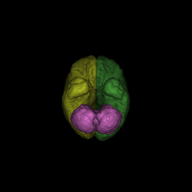

# Volumetric Visualization

> This repository aims to explore techniques to visualize volumetric images. Moreover, it also explores image segmentation through the image operator Image Foresting Transform (IFT).

<p align="center">

</img>
</p>


This repository arose from the course "MO815A - Volumetric Image Visualization," which occurred in the first semester of 2023. The course was ministered by Alexandre Falcão from UNICAMP's Computing Institute.

X-ray computed tomography (CT), confocal microscopy, and magnetic resonance (MR) are examples of several imaging modalities that outcome volumetric (or 3D) images. These imaging modalities provide visual information to study the interior of humans, animals, plants, and minerals, with many applications to Medicine, Geology, Biology, and other areas of Sciences and Engineering. A fundamental problem, however, is the visualization of the content of interest in those 3D images, named objects, which might be pores of a rock, organs of a human body, and stem cells of a plant, for instance.

In the course, we learned the basic operations of Image Processing and Computer Graphics for visualizing objects of interest from volumetric images.

# Repository Organization

The following summarizes all the code available:

- **1_get_slices:** Approaches slicing, linear stretching, and color transformations. Here, we
explore techniques to extract 2D axial slices and process them for better visualization,
according to the user (i.e., radiologist, neuroradiologist);
- **2_mip:** Deals with visualizing images from different perspectives by applying ray-tracing and maximum intensity projection. This code introduces techniques, such as ray-tracing and drawing the wireframe, that will be used in the following sections;
- **3_reslicing_and_reformating:** Explores the visualization of a scene by aligning an arbitrary plane to a scene voxel and advancing through the scene following a defined angle. As it will result in an anisotropic scene, we must reformat the output image to turn it into an isotropic one;
- **4_segmentation:** Explores the use of the IFT to segment brain tumors (Gliomas);
- **5_curvilinear_cuts:** When dealing with complex surfaces, such as the brain surface, the visualization of the surface is of central importance. It helps us to tackle problems such as focal cortical dysplasia (FCD). Here, we apply the Euclidean distance transformation to extract brain ISO-Surfaces;
- **6_opaque_rendering:** To visualize segmented tissues, we could apply ray-casting and Phong's model to visualize opaque objects and how they interact with each other;
- **7_transparent_rendering:** Finally, we expand the code developed previously (6_opaque_rendering) to improve our visualization and deal with objects' visibility and opacity.
# Preparing the environment

To enable code compilation, one must first download the ift library. Available at [Falcão's page](https://www.ic.unicamp.br/~afalcao/mo815-3dvis/libmo815-3dvis.tar.bz2).

After downloading the library, put it into the repository's root, under the folder lib, and further extract it.

Additional packages must be necessary. Just install them using a package manager:

```bash
sudo pacman -Sy cblas
```

# Compiling and executing code

To compile and execute each code, just follow the steps below:

1. Navigate to the folder directory: ```cd 2_mip```.
2. Compile the code ```make```
3. Execute the code:
```bash
./bin/main ../0_data/input/thorax.scn 50 30 \
../0_data/input/left-lung.scn \
data/max_intensity_projection_colored.png \
data/max_intensity_projection_gray.png 0.3 0.8
```

For each application, on main.c there is a comment detailing how to execute the code.
